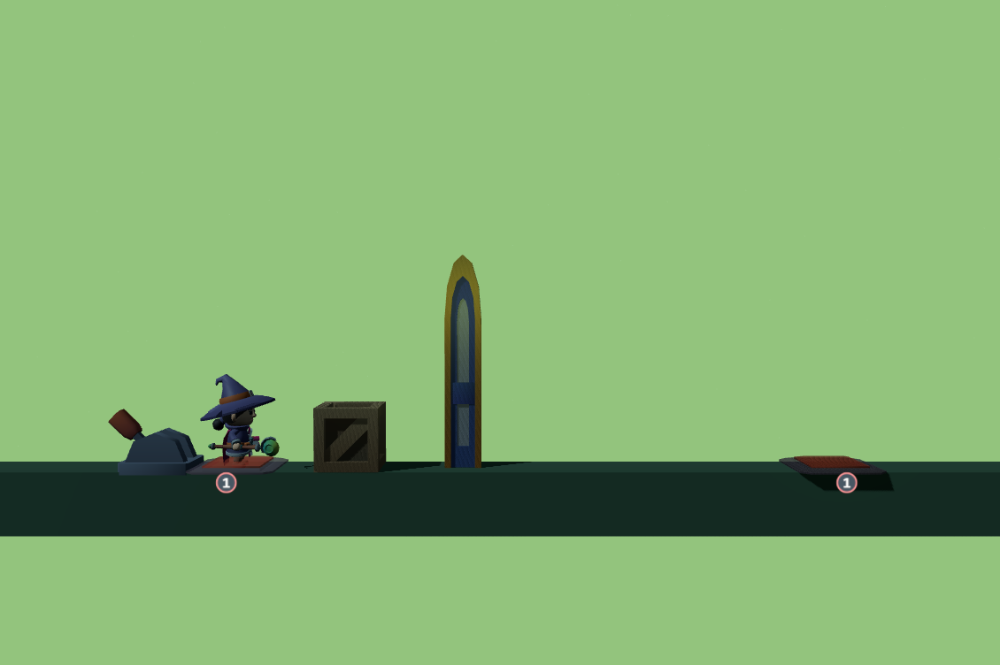
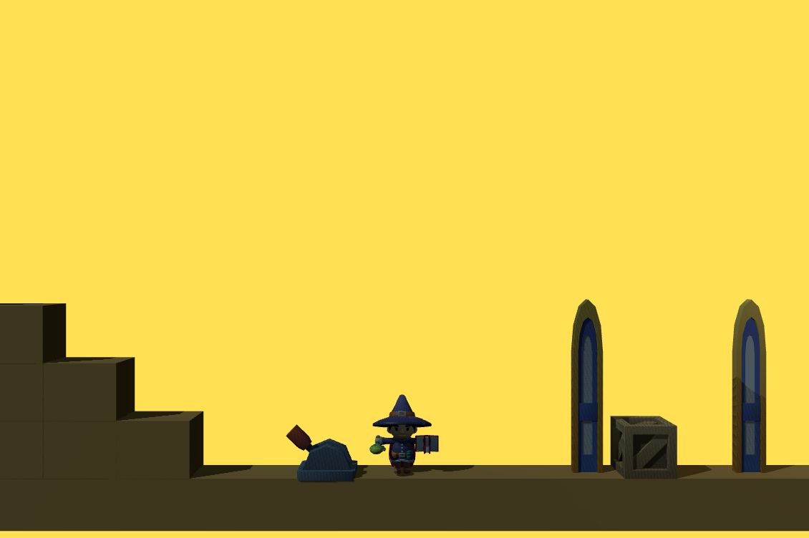
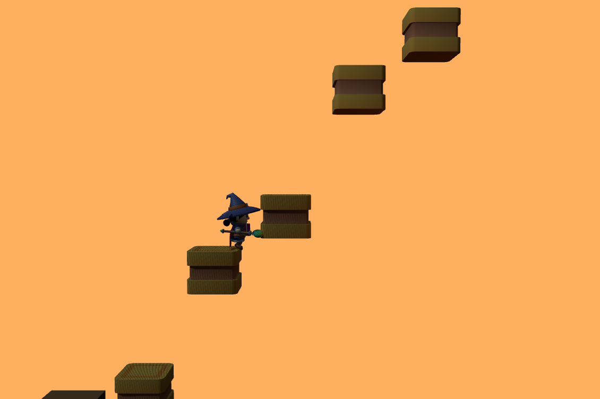
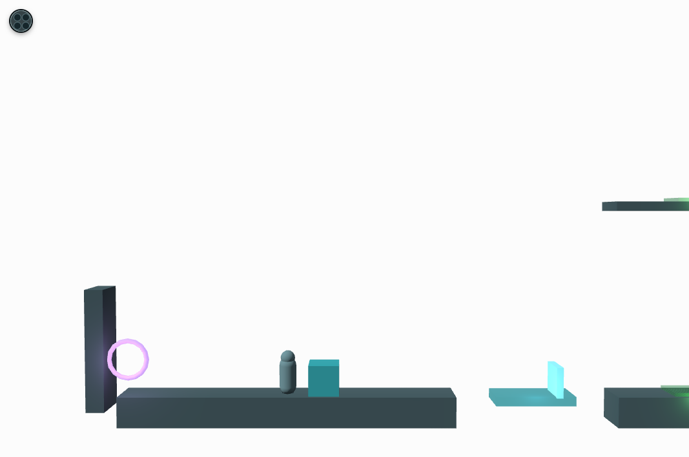

# What the Snow Remembers

**[Play the live demo](https://chien521.github.io/adventure_game/)**

*What the Snow Remembers* is a browser-based 3D puzzle-platform adventure about crossing four changing landscapes and recovering fragments of a life that has been forgotten. Each season is a compact, hand-built challenge where blocks, triggers, doors, lifts, levers, and routes must be read as one connected machine.

The game is built with [Three.js](https://threejs.org/) and [Vite](https://vitejs.dev/). It runs entirely in the browser with no account, download, or backend required.

## At A Glance

- Four playable chapters: spring, summer, autumn, and winter.
- Optional memory keys that change the final ending text.
- Physics-based block carrying, placement, falling, and lift support.
- Route-switching puzzles with doors, levers, floor triggers, bridges, and moving platforms.
- Checkpoint and route-aware recovery designed to return the player to a useful puzzle state.
- A built-in two-page how-to-play guide with live gameplay examples.
- A live run timer, and optional VIVERSE integration: play as your own VIVERSE avatar, browse global speedrun records with no login required, and submit your own time once you connect an account.

## Screenshots

| Spring: Home Falls Behind | Summer: Two Shadows Linger |
| --- | --- |
|  |  |
| Autumn: One Shadow Remains | Winter: Snow Remembers Home |
|  |  |

## Story And Goal

The Traveler wakes in the snow with no name, no memory, and only a hollow locket at their chest — four empty spaces where something used to be. They don't have to fill it. Nothing forces them through spring, summer, autumn, and winter looking for what's missing; they could walk the whole way and arrive with the locket exactly as empty as it started. But something in them wants to remember anyway.

Nothing is explained during play. The story is told entirely in first person, through the passage the Traveler reads before setting out and the one they read at the very end — and the ending changes based on how many of the four memory keys were recovered along the way. Reach the end with none, and the passage is cold and unresolved: *"I reached the end and remembered nothing."* Reach it with all four, and the fragments resolve into a single, specific memory of someone once loved — one season for a hand letting go at a doorway, one for being looked at like something worth keeping, one for a goodbye at a door someone didn't come back through, and one for finally arriving, in winter, at a house they recognize.

### A Life In Four Seasons

- **Spring — a hand letting go:** sent out alone for the first time, small enough that the whole world came up to their shoulders.
- **Summer — being looked at:** warmth, and someone turning to look at them the way you look at something you've decided to keep.
- **Autumn — a door:** a quieter goodbye, and a weight set down the way you set down something you already know you won't pick back up.
- **Winter — the house:** the long walk after, and — finally, if enough of it was recovered — a house up ahead that they know.

The keys never gate progress; every chapter's portal is reachable without one. They only change what the ending remembers, which is what makes recovering them a choice rather than a requirement.

## How To Play

| Input | Action |
| --- | --- |
| `A` / `D` or Left / Right Arrow | Move |
| `W` or Space | Jump |
| `E` | Carry or place a block; use a nearby lever |
| `Q` | Use a nearby visible portal |
| Escape | Pause |

### Mobile Controls

The live demo supports both portrait and landscape play on touch devices. Use the left and right controls to move, the triangle to jump, `C` to carry blocks or operate levers, and `Q` at a visible portal. Controls are positioned around device safe areas and do not require the browser to be locked to one orientation.

### Puzzle Vocabulary

**Blocks** are the primary movable tools. Carry one with `E`, then press `E` again to release it onto a supported surface. A block can activate floor triggers, hold a route open, or provide a launch point: standing on a block before jumping grants one additional jump.

**Numbered triggers** have limited uses. Once their remaining activations are spent, they lock. **Green infinity triggers** can be reused by moving the block off the plate and placing it back again.

**Levers** can open a route, reveal a hidden interaction, activate a lift, or expose a portal. Some are one-shot controls; others can be toggled. **Doors** do not merely disappear: in several puzzles they physically move between ground and upper routes, so changing one route can block or open another.

**Portals** are chapter exits and return points. A portal must be visible and approached before `Q` can activate it. **Checkpoints** and route-aware recovery keep failures short while preserving the puzzle's intended state.

## Chapters

### 01. Spring — Home Falls Behind

A green, flooded threshold where the basic language of the game is introduced: carry a block, use it on plates, open doors, and chain route changes across a canyon. The optional key is behind its own block-and-trigger problem.

### 02. Summer — Two Shadows Linger

A bright industrial landscape built around stacked climbable structures, distant banks, and a bridge over a canyon. The chapter layers levers, doors, platforms, and a high hidden-key route that requires careful block use and jumping.

### 03. Autumn — One Shadow Remains

An orange mechanical ascent with moving crushers, alternating footholds, a vertical key route, and a lift that reconnects distant levels. The chapter emphasizes timing, safe staging points, and choosing the correct return route.

### 04. Winter — Snow Remembers Home

A white, two-level puzzle centered on a manual elevator and two coupled routes. The block can travel on the lift, reusable infinity triggers move blockers between ground and upper paths, and separate levers reveal the key and exit portal. Winter also has deliberate recovery rules: a fall from the right wall returns to the top route, while right-void falls restore the player and block to the appropriate route beside the relevant lever.

## VIVERSE Integration

The game is fully playable with no account, and never contacts VIVERSE unless you explicitly ask it to:

- **Use my VIVERSE avatar** (start screen) — logs into your VIVERSE account and replaces the default traveler with your own equipped avatar for the rest of the session.
- **See records** (start screen and ending screen) — opens a records window with two global leaderboards, fastest full run and fastest run with all 4 keys, viewable without logging in.
- **Submit my run** (ending screen, after finishing all four chapters) — only enabled once you've connected a VIVERSE account; uploads your run time to the full-run leaderboard, and to the all-keys leaderboard too if you collected all four memory keys.

## Technical Notes

The game uses vanilla ES modules with a small custom 2D gameplay layer rendered through Three.js:

- `src/main.js` owns the game loop, chapter transitions, UI, pause flow, and ending.
- `src/chapters/` holds data-driven positions and puzzle configuration for each season.
- `src/world/ChapterLoader.js` builds each chapter's runtime mechanics.
- `src/world/Interactables.js` contains blocks, levers, doors, and pressure plates.
- `src/core/` contains input, camera, audio, checkpoints, physics, and game-loop utilities.
- `src/viverse/ViverseSession.js` is the single entry point for VIVERSE login, avatar, and leaderboard calls.
- `public/` contains the chapter and guide screenshots used by the menu and documentation.

## Run Locally

Prerequisite: a current Node.js LTS installation.

```bash
npm install
npm run dev
```

Vite prints the local development URL, usually `http://127.0.0.1:5173/`.

VIVERSE login and leaderboard submission only work once the game is actually hosted on a VIVERSE World (see `.env.example` for the required `VITE_VIVERSE_*` variables); locally they show a graceful "unavailable" status instead.

### Production Build

```bash
npm run build
npm run preview
```

`npm run build` outputs the production site to `dist/`.

## Deployment

Pushes to `main` are automatically built and deployed to GitHub Pages through [the deployment workflow](.github/workflows/deploy.yml).
